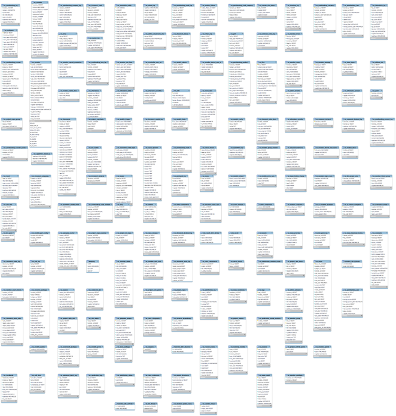
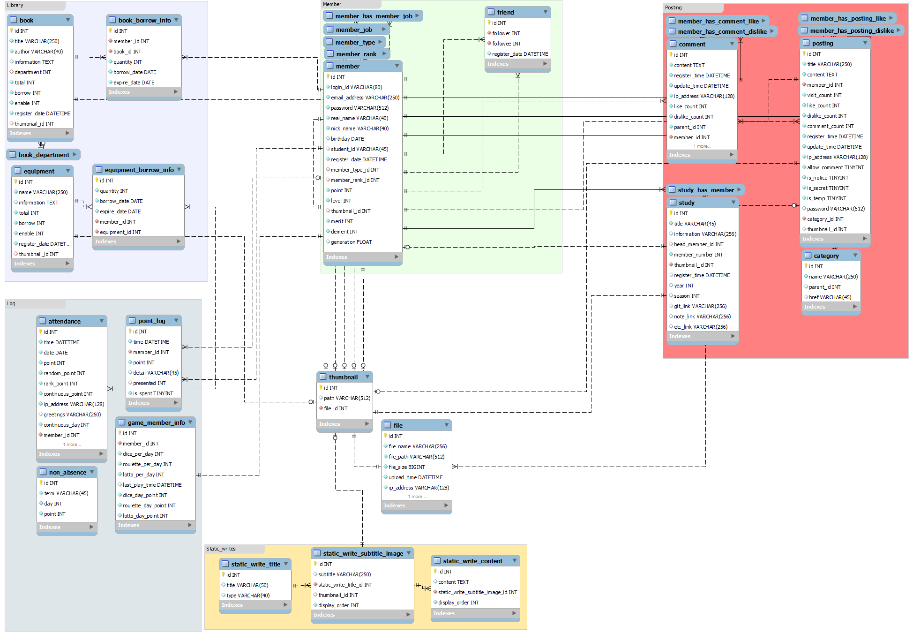

<div align="center">
  
  <br>

  <h1>DBMigration</h1>

  <h4>DB 이관에 관련된 코드나 SQL을 모아놓는 repo입니다.</h4>

   
  

</div>

<br/>

### Introduction
&nbsp;&nbsp;기존 KEEPER 홈페이지는 [XpressEngine](https://www.xpressengine.com/)으로 생성된 웹사이트였습니다. DB 또한 해당 엔진으로 자동 생성 되었는데, [DB ASIS](#DB-ASIS)에서 볼 수 있듯이 테이블이 아주 많고, 복잡하고, 관계도 없습니다. 따라서 DB를 그대로 기용하기엔 불가능한 환경임을 고려, [새 DB](#DB-TOBE)를 설계하게 되었고, 이에 기존의 데이터를 이관하게 되었습니다.

### Features
[Modules description](./FEATURE.md)

### How to use (Linux)

```bash
git clone https://github.com/KEEPER31337/Homepage-DBMigration.git

cd Homepage-DBMigration

# We recommend read comments of below script before execute it... 
./script/migrate_keeper_db.sh
```

### Required Python package
[requirements.txt](./requirements.txt)  

<a href="https://pypi.org/project/setuptools/"></a>
<a href="https://pypi.org/project/PyMySQL/"></a>
<a href="https://lxml.de/"></a>
<a href="https://pypi.org/project/markdownify/"></a>
<a href="https://pypi.org/project/multipledispatch/"></a>

### DB ASIS


### DB TOBE
- 20220610 UPDATED

